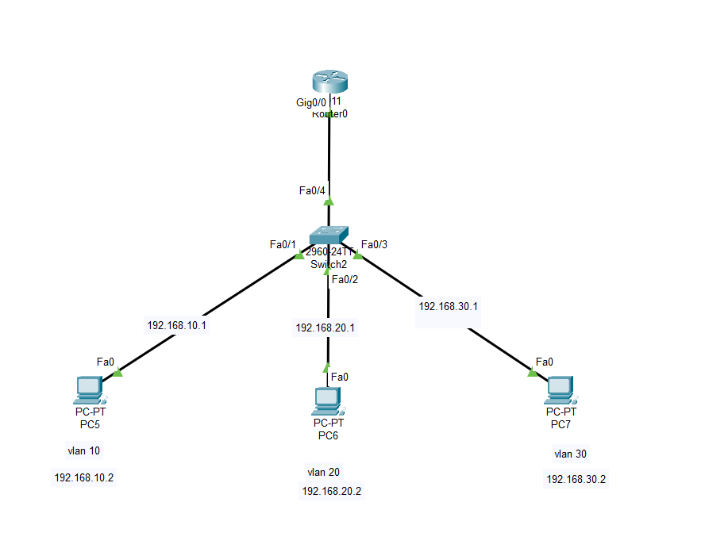
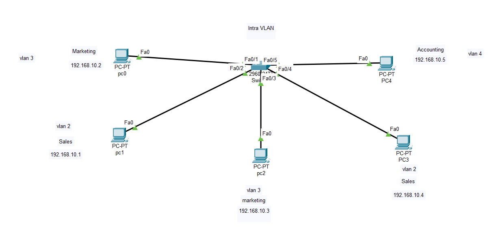

# EXP-7 Configuration Of VLAN (Inter VLAN and Intra VLAN )

🎯 **AIM:**
-----------

To configure and establish communication between different VLANs on a switch and router, enabling both intra-VLAN (within same VLAN) and inter-VLAN (between different VLANs) communication.

* * * * *

📚 **DESCRIPTION:**
-------------------

-   **Intra-VLAN Communication**:\
    ➔ Devices inside the same VLAN can communicate **directly** through the switch (no router needed).\
    ➔ Same broadcast domain.

-   **Inter-VLAN Communication**:\
    ➔ Devices in **different VLANs** cannot talk directly.\
    ➔ A **Router** (Router-on-a-Stick) or **Layer 3 Switch** is needed to route between VLANs.
---
# 🧠 What Are We Doing in VLAN Configuration?

We're basically setting up a **smart system** where:

- 🧑‍💻 Some computers are grouped into **different "teams"** (Sales, Marketing, Accounting).
- 📶 These groups (called **VLANs**) **can talk among themselves** easily (Intra-VLAN communication).
- 🚪 And if **one group needs to talk to another group** (Inter-VLAN communication), we make it happen by using a **Router** (or a Layer 3 Switch).

---

# 🎯 Why We Are Doing This:

| **Without VLANs** | **With VLANs** |
|:---|:---|
| All devices are in the same big network — total chaos! 🚨 (Anyone can talk to anyone, even if not needed.) | Devices are neatly separated into different teams (VLANs). Better control, better security. 🔒 |
| No traffic management. | Only necessary devices communicate = network faster and less congested. 🚀 |
| Hackers, viruses can spread faster. | VLANs isolate devices = more secure network. 🔥 |

---

# 🛠 What Each Step Means:

## 1. **Creating VLANs (Sales, Marketing, Accounting)**:
- We create **virtual groups** inside the switch.
- Example: VLAN 2 = Sales team, VLAN 3 = Marketing team.

## 2. **Assigning VLANs to Switch Ports**:
- We say **"Hey port Fa0/2, you belong to Sales (VLAN 2)"**.
- We link PCs physically to the right VLAN.

## 3. **Intra-VLAN Communication**:
- **Devices inside the SAME VLAN can communicate directly** through the switch, no router needed.

✌️ **Example**:  
PC1 (in VLAN 2) ↔ PC2 (also in VLAN 2) = Direct communication!

## 4. **Configuring Router for Inter-VLAN Communication**:
- **Buttt** if a Sales guy needs to email the Marketing team 👨‍💼➡👩‍💼? (Different VLANs? ❌)
- VLANs are isolated by default — they **can't talk without help**.
- So we configure a **Router** (or Router-on-a-stick setup).
- **Subinterfaces** (like g0/0.10, g0/0.20, etc.) are made for each VLAN with their IP addresses.

✌️ **Example**:  
Sales (192.168.10.0/24) ↔ Router ↔ Marketing (192.168.20.0/24)

**Router acts like a translator 🧏 between different VLANs.**

---

# 🔥🔥 Super Quick Real-Life Example:
Imagine you are in a **college**:
- Different **departments**: CSE, ECE, MECH (these are like VLANs).
- Students in **CSE department** talk among themselves freely.
- But if a **CSE student** wants to ask something to an **ECE student**,  
  → **They need to go through the main office** (router!!).

---

# 🤙 In short bruhh:

| Term | Meaning |
|:---|:---|
| Intra-VLAN | Talk within same group (directly inside switch) |
| Inter-VLAN | Talk between different groups (needs a router) |
| VLAN | Logical group inside switch to manage traffic |
| Router-on-a-Stick | Router using subinterfaces to route between VLANs |

---

# 🔵 **Switch Commands for Inter-VLAN Communication (Full Step-by-Step)**
## 🖥️ **TOPOLOGY:**

> A simple Inter-VLAN topology with One Router and One Switch with different VLANs 

### 

---

## **Step 1: Access the Switch CLI**

```bash
Switch> enable
Switch# configure terminal
```

---

## **Step 2: Create VLANs**

```bash
Switch(config)# vlan 10
Switch(config-vlan)# name Sales
Switch(config-vlan)# exit

Switch(config)# vlan 20
Switch(config-vlan)# name Marketing
Switch(config-vlan)# exit

Switch(config)# vlan 30
Switch(config-vlan)# name Accounting
Switch(config-vlan)# exit
```

---

## **Step 3: Assign Ports to VLANs**

### Assign VLAN 10 to Fa0/2
```bash
Switch(config)# interface fa0/2
Switch(config-if)# switchport mode access
Switch(config-if)# switchport access vlan 10
Switch(config-if)# exit
```

### Assign VLAN 20 to Fa0/3
```bash
Switch(config)# interface fa0/3
Switch(config-if)# switchport mode access
Switch(config-if)# switchport access vlan 20
Switch(config-if)# exit
```

### Assign VLAN 30 to Fa0/4
```bash
Switch(config)# interface fa0/4
Switch(config-if)# switchport mode access
Switch(config-if)# switchport access vlan 30
Switch(config-if)# exit
```

---

## **Step 4: Verify VLAN Configuration**

```bash
Switch# show vlan brief
```
✅ This command **displays** all VLANs created and **shows which ports are assigned** to which VLAN.

---

## **Step 5: Configure the Trunk Port (VERY IMPORTANT for Inter-VLAN)**

- The **port that connects the Switch to the Router** (example: `fa0/5`) must be a **trunk** because **multiple VLANs** need to pass through a single cable.

```bash
Switch(config)# interface fa0/5
Switch(config-if)# switchport mode trunk
Switch(config-if)# exit
```

✅ Now Fa0/5 will **carry traffic for all VLANs** to the Router.

---

## **Step 6: View the Full Configuration (Optional)**

```bash
Switch# show run
```

### ✨ **Explanation of `show run` command:**
- `show run` = **show running-configuration**
- It **displays the current configuration** stored in the switch's **RAM**.
- You can **verify all the settings** like:
  - VLAN configurations
  - Trunk and Access port settings
  - Interface status
  - Any IP configurations (if Layer 3 switch)
  
**In simple words:**  
🔎 **It shows everything that you have configured till now on the switch.**

---

# 🛜 **Next: Router Configuration for Inter-VLAN Routing (Router-on-a-Stick)**

---

## **Step 7: Configure Router Subinterfaces**

Suppose the router port connected to the switch is **GigabitEthernet0/0**.

```bash
Router> enable
Router# configure terminal
```

---

### Create Subinterface for VLAN 10
```bash
Router(config)# interface gigabitEthernet0/0.10
Router(config-subif)# encapsulation dot1Q 10
Router(config-subif)# ip address 192.168.10.1 255.255.255.0
Router(config-subif)# exit
```

---

### Create Subinterface for VLAN 20
```bash
Router(config)# interface gigabitEthernet0/0.20
Router(config-subif)# encapsulation dot1Q 20
Router(config-subif)# ip address 192.168.20.1 255.255.255.0
Router(config-subif)# exit
```

---

### Create Subinterface for VLAN 30
```bash
Router(config)# interface gigabitEthernet0/0.30
Router(config-subif)# encapsulation dot1Q 30
Router(config-subif)# ip address 192.168.30.1 255.255.255.0
Router(config-subif)# exit
```

---

### Enable the Physical Interface (if not already)

```bash
Router(config)# interface gigabitEthernet0/0
Router(config-if)# no shutdown
Router(config-if)# exit
```

---

## **Step 8: Final Test**

- Assign IP addresses to the PCs according to their VLANs.
- Set the **default gateway** on each PC to the **router subinterface IP** (e.g., 192.168.10.1 for VLAN 10).
- Ping from one PC to another PC in different VLANs.

✅ If the ping is successful ➔ **Inter-VLAN routing is complete!**

---

# ✅ **Summary**

| Step | Switch Commands                     | Router Commands                            |
|:----:|:------------------------------------|:-------------------------------------------|
| 1    | Create VLANs                        | Create subinterfaces (one for each VLAN)   |
| 2    | Assign access ports                 | Configure IP addresses on subinterfaces    |
| 3    | Make trunk port for router connection | Enable router's physical interface        |
| 4    | Verify with `show vlan brief` and `show run` | Test with ping |

---
📜 **Useful Verification Commands**
===================================

| Command | Use |
| --- | --- |
| `show vlan brief` | View VLANs and port assignments |
| `show interfaces trunk` | View trunk port status |
| `show running-config` | View entire device configuration |
| `show ip interface brief` | View IP address assigned to router interfaces |

* * * * *

✨ **Extra Quick Notes**
=======================

-   **Access Mode** ➔ Used to connect PCs to specific VLANs.

-   **Trunk Mode** ➔ Used between Switch and Router (or between two switches).

-   **Subinterface** ➔ A logical interface under one physical interface on router for each VLAN.

-   **Router-on-a-Stick** ➔ One physical cable handles all VLAN traffic.

* * * * *

📦 **Components Required (in Packet Tracer)**
=============================================

| Component | Quantity | Notes |
| --- | --- | --- |
| Switch (Layer 2) | 1 | Any basic switch (e.g., 2960) |
| Router (Layer 3) | 1 | Any router (e.g., 2911, 1941) |
| PCs | 3-5 | Assign each to different VLANs |
| Copper Straight-through Cable | As needed | For PC-to-Switch and Switch-to-Router connections |

---


# **Intra-VLAN Communication** (Within the Same VLAN)

### **Components Needed:**
- **1 Switch**
- **2 or more PCs** (to represent devices in the same VLAN)
---
## 🖥️ **TOPOLOGY:**

> A simple switch-based network where each port is assigned to a specific VLAN.  
> (PCs belonging to the same VLAN communicate directly.)

### 

---

### **Step-by-Step Configuration:**

#### **Step 1: Create VLANs on the Switch**

1. **Access the Switch CLI** in **Packet Tracer**:
   - Click on the **Switch** to open the CLI.
   - Enter global configuration mode:
     ```bash
     Switch> enable
     Switch# configure terminal
     ```

2. **Create VLANs** for different departments:
   ```bash
   Switch(config)# vlan 10
   Switch(config-vlan)# name Sales
   Switch(config-vlan)# exit
   Switch(config)# vlan 20
   Switch(config-vlan)# name Marketing
   Switch(config-vlan)# exit
   Switch(config)# vlan 30
   Switch(config-vlan)# name Accounting
   Switch(config-vlan)# exit
   ```

---

#### **Step 2: Assign VLANs to Switch Ports**

- Assign each VLAN to a port on the **Switch**. For example:

1. **Assign VLAN 10 (Sales)** to **Fa0/2**:
   ```bash
   Switch(config)# interface fa0/2
   Switch(config-if)# switchport mode access
   Switch(config-if)# switchport access vlan 10
   Switch(config-if)# exit
   ```

2. **Assign VLAN 20 (Marketing)** to **Fa0/3**:
   ```bash
   Switch(config)# interface fa0/3
   Switch(config-if)# switchport mode access
   Switch(config-if)# switchport access vlan 20
   Switch(config-if)# exit
   ```

3. **Assign VLAN 30 (Accounting)** to **Fa0/4**:
   ```
   Switch(config)# interface fa0/4
   Switch(config-if)# switchport mode access
   Switch(config-if)# switchport access vlan 30
   Switch(config-if)# exit
   ```

---

#### **Step 3: Verify VLAN Configuration**

1. **Check the VLAN configuration**:
   ```bash
   Switch# show vlan brief
   ```
   This will show you a list of all the VLANs created and their assigned ports.

---

#### **Step 4: Test Intra-VLAN Communication**

- **Assign IP addresses** to the PCs in the same VLAN:
  - **PC0** (VLAN 10): IP: `192.168.10.2`, Subnet: `255.255.255.0`, Gateway: `192.168.10.1`
  - **PC1** (VLAN 20): IP: `192.168.20.2`, Subnet: `255.255.255.0`, Gateway: `192.168.20.1`
  - **PC2** (VLAN 30): IP: `192.168.30.2`, Subnet: `255.255.255.0`, Gateway: `192.168.30.1`

- **Ping between PCs** in the same VLAN:
  - For example, to ping **PC0 to PC1** (same VLAN), use:
    ```
    PC0> ping 192.168.10.2  (Intra-VLAN ping within the same VLAN)
    ```

    Since this is within the same VLAN, the communication will work without requiring a router.

---
✅ **Meaning:**

-   Port **fa0/2** ➔ VLAN 10 (Sales)

-   Port **fa0/3** ➔ VLAN 20 (Marketing)

-   Port **fa0/4** ➔ VLAN 30 (Accounting)

* * * * *

📜 **Useful Verification Command**
==================================

| Command | Use |
| --- | --- |
| `show vlan brief` | Shows VLANs, names, and which ports are assigned |

* * * * *

📦 **Components Required (in Packet Tracer)**
=============================================

| Component | Quantity | Notes |
| --- | --- | --- |
| Switch (Layer 2) | 1 | Example: Cisco 2960 |
| PCs | 3 or more | Connect different PCs to different VLANs |
| Copper Straight-through Cable | As needed | Connect PCs to Switch |

---